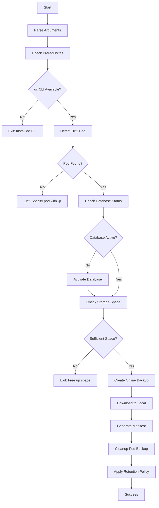

# 🗄️ Sterling B2Bi DB2 Database Backup Guide

Comprehensive guide for backing up the Sterling B2Bi DB2 database before performing upgrades or rollbacks.

---

## 📋 Table of Contents

- [Overview](#overview)
- [Prerequisites](#prerequisites)
- [Quick Start](#quick-start)
- [Script Features](#script-features)
- [Usage Examples](#usage-examples)
- [Backup Process Flow](#backup-process-flow)
- [Restore Procedures](#restore-procedures)
- [Troubleshooting](#troubleshooting)
- [Best Practices](#best-practices)

---

## 🎯 Overview

The `backup-b2bi-db2.sh` script provides a **production-ready solution** for backing up Sterling B2Bi DB2 databases in OpenShift/Kubernetes environments. It performs **online backups** (no downtime required) with compression, automatic cleanup, and comprehensive validation.

### Key Capabilities

| Feature | Description |
|---------|-------------|
| **Online Backup** | No database downtime required |
| **Compression** | Reduces backup size by ~50-70% |
| **Auto-Detection** | Automatically finds DB2 pod and database |
| **Validation** | Checks prerequisites, storage, and connectivity |
| **Retention Policy** | Automatically removes old backups |
| **Manifest Generation** | Creates detailed backup metadata |
| **Error Handling** | Comprehensive error checking and rollback |

---

## ✅ Prerequisites

### Required Tools
- ✅ **oc CLI** - OpenShift command-line tool
- ✅ **bash** - Version 4.0 or higher
- ✅ **Authenticated session** - `oc login` completed

### Required Permissions
- ✅ Read access to target namespace
- ✅ Exec permissions on DB2 pod
- ✅ Ability to copy files from pods

### Storage Requirements
- ✅ **DB2 Pod**: 2x database size available
- ✅ **Local Filesystem**: 1x database size available

### Verification Commands
```bash
# Check oc CLI
oc version

# Verify authentication
oc whoami

# Check namespace access
oc get pods -n ibm-b2bi-dev01-app

# Check DB2 pod
oc get pods -n ibm-b2bi-dev01-app -l app.kubernetes.io/component=db2
```

---

## 🚀 Quick Start

### Basic Backup (Default Settings)
```bash
cd sterling-deployer/sfg
./backup-b2bi-db2.sh
```

**Default Configuration:**
- Namespace: `ibm-b2bi-dev01-app`
- Database: `B2BIDB`
- Output: `./db2-backups/`
- Retention: 5 backups

### Custom Namespace and Database
```bash
./backup-b2bi-db2.sh -n my-namespace -d MYDB
```

### Specify DB2 Pod Explicitly
```bash
./backup-b2bi-db2.sh -p s0-db2-0
```

---

## 🎨 Script Features

### 1. **Intelligent Pod Detection**
```bash
# Tries multiple detection methods:
# 1. Label: app.kubernetes.io/component=db2
# 2. Label: role=db2
# 3. Name pattern: *db2*
```

### 2. **Storage Validation**
```bash
# Checks:
# - Database size
# - Available space in pod
# - Local filesystem space
# - Ensures 2x database size available
```

### 3. **Backup Manifest**
Every backup includes a detailed manifest file:
```
backup-manifest.txt
├── Backup Information (timestamp, database, pod)
├── File Details (size, checksum, path)
├── Database Statistics
├── Environment Info
└── Restore Instructions
```

### 4. **Automatic Cleanup**
```bash
# Retention policy (default: 5 backups)
# Automatically removes oldest backups
# Keeps manifest files for audit trail
```

---

## 📚 Usage Examples

### Example 1: Production Backup Before Upgrade
```bash
# Full backup with custom retention
./backup-b2bi-db2.sh \
  -n ibm-b2bi-prod-app \
  -d B2BIDB \
  -o /backups/production \
  -r 10
```

**Output:**
```
╔════════════════════════════════════════════════════════════════╗
║  Sterling B2Bi DB2 Database Backup Script                      ║
╚════════════════════════════════════════════════════════════════╝

ℹ Configuration:
  Namespace:     ibm-b2bi-prod-app
  Database:      B2BIDB
  Output Dir:    /backups/production
  Retention:     10 backups

▶ Checking prerequisites
✓ oc CLI found
✓ Authenticated as admin
✓ Namespace 'ibm-b2bi-prod-app' exists
✓ Output directory ready: /backups/production

▶ Detecting DB2 pod
✓ DB2 pod detected: s0-db2-0 (status: Running)

▶ Checking database status
ℹ DB2 instance owner: db2inst1
✓ Database 'B2BIDB' is accessible

▶ Checking storage space
ℹ Database size: 45 GB (46080 MB)
ℹ Available space in DB2 pod: 120000 MB
✓ Sufficient storage available for backup

▶ Creating DB2 backup
ℹ Creating backup directory in pod...
ℹ Starting online backup (this may take several minutes)...
⏳ Please wait...
✓ Backup created successfully
ℹ Backup file: B2BIDB.0.db2inst1.DBPART000.20260302220500.001
ℹ Backup size: 18G

▶ Downloading backup to local filesystem
ℹ Downloading to: /backups/production/b2bidb_backup_20260302_220500
⏳ Please wait...
✓ Backup downloaded successfully
ℹ Local backup size: 18G

▶ Creating backup manifest
✓ Manifest created: /backups/production/b2bidb_backup_20260302_220500/backup-manifest.txt

▶ Cleaning up backup from DB2 pod
ℹ Removing backup file from pod to free space...
✓ Pod cleanup complete

▶ Cleaning up old backups (retention: 10)
ℹ Current backup count: 8
ℹ No cleanup needed (within retention limit)

╔════════════════════════════════════════════════════════════════╗
║  ✓ Backup Completed Successfully                              ║
╚════════════════════════════════════════════════════════════════╝

ℹ Backup Details:
  Location:      /backups/production/b2bidb_backup_20260302_220500
  Manifest:      /backups/production/b2bidb_backup_20260302_220500/backup-manifest.txt
  Backup File:   B2BIDB.0.db2inst1.DBPART000.20260302220500.001

✓ You can now safely proceed with upgrade or rollback operations

ℹ To restore this backup:
  1. Review restore instructions in backup-manifest.txt
  2. Copy backup to DB2 pod
  3. Run DB2 restore command
```

### Example 2: Development Environment Backup
```bash
# Quick backup with minimal retention
./backup-b2bi-db2.sh -n ibm-b2bi-dev01-app -r 3
```

### Example 3: Backup with Specific Pod Name
```bash
# When auto-detection fails or multiple DB2 pods exist
./backup-b2bi-db2.sh -p s0-db2-0 -n ibm-b2bi-dev01-app
```

### Example 4: Custom Output Directory
```bash
# Store backups in specific location
./backup-b2bi-db2.sh -o /mnt/nfs/db2-backups -r 20
```

---

## 🔄 Backup Process Flow



### Detailed Steps

1. **Prerequisites Check** (5-10 seconds)
   - Validates oc CLI installation
   - Verifies OpenShift authentication
   - Confirms namespace access
   - Creates output directory

2. **Pod Detection** (2-5 seconds)
   - Auto-detects DB2 pod using labels
   - Falls back to name pattern matching
   - Verifies pod is in Running state

3. **Database Validation** (5-10 seconds)
   - Identifies DB2 instance owner
   - Checks database active status
   - Activates database if needed
   - Tests connectivity

4. **Storage Check** (5-10 seconds)
   - Calculates database size
   - Checks available space in pod
   - Ensures 2x database size available
   - Validates local filesystem space

5. **Backup Creation** (5-30 minutes, depends on DB size)
   - Creates backup directory in pod
   - Executes online compressed backup
   - Monitors backup progress
   - Verifies backup file creation

6. **Download** (2-15 minutes, depends on DB size)
   - Copies backup from pod to local
   - Verifies file integrity
   - Calculates checksums

7. **Manifest Generation** (1-2 seconds)
   - Creates detailed metadata file
   - Includes restore instructions
   - Documents environment details

8. **Cleanup** (5-10 seconds)
   - Removes backup from pod
   - Applies retention policy
   - Removes old backups if needed

---

## 🔧 Restore Procedures

### Method 1: Using Manifest Instructions

Every backup includes a `backup-manifest.txt` file with specific restore commands:

```bash
# 1. View manifest
cat db2-backups/b2bidb_backup_20260302_220500/backup-manifest.txt

# 2. Follow restore instructions in manifest
# Example commands will be provided in the manifest
```

### Method 2: Manual Restore

```bash
# Step 1: Copy backup to DB2 pod
BACKUP_DIR="db2-backups/b2bidb_backup_20260302_220500"
BACKUP_FILE="B2BIDB.0.db2inst1.DBPART000.20260302220500.001"
NAMESPACE="ibm-b2bi-dev01-app"
DB2_POD="s0-db2-0"

oc exec -n $NAMESPACE $DB2_POD -- mkdir -p /database/restore

oc cp "$BACKUP_DIR/$BACKUP_FILE" \
  "$NAMESPACE/$DB2_POD:/database/restore/$BACKUP_FILE"

# Step 2: Stop Sterling B2Bi application
oc scale statefulset s0-b2bi-asi-server -n $NAMESPACE --replicas=0
oc scale statefulset s0-b2bi-ac-server -n $NAMESPACE --replicas=0
oc scale statefulset s0-b2bi-api-server -n $NAMESPACE --replicas=0

# Step 3: Restore database
oc exec -n $NAMESPACE $DB2_POD -- su - db2inst1 -c \
  "db2 restore database B2BIDB from /database/restore"

# Step 4: Verify database
oc exec -n $NAMESPACE $DB2_POD -- su - db2inst1 -c \
  "db2 connect to B2BIDB"

oc exec -n $NAMESPACE $DB2_POD -- su - db2inst1 -c \
  "db2 'SELECT COUNT(*) FROM SYSCAT.TABLES'"

# Step 5: Restart Sterling B2Bi application
oc scale statefulset s0-b2bi-asi-server -n $NAMESPACE --replicas=2
oc scale statefulset s0-b2bi-ac-server -n $NAMESPACE --replicas=1
oc scale statefulset s0-b2bi-api-server -n $NAMESPACE --replicas=1
```

### Method 3: Point-in-Time Recovery

For rollforward recovery after restore:

```bash
# After restore, rollforward to specific point in time
oc exec -n $NAMESPACE $DB2_POD -- su - db2inst1 -c \
  "db2 rollforward database B2BIDB to end of logs and complete"
```

---

## 🔍 Troubleshooting

### Issue 1: Pod Detection Fails

**Symptom:**
```
✗ Could not auto-detect DB2 pod. Please specify with -p option.
```

**Solution:**
```bash
# List all pods to find DB2 pod
oc get pods -n ibm-b2bi-dev01-app

# Specify pod explicitly
./backup-b2bi-db2.sh -p <pod-name>
```

### Issue 2: Insufficient Storage

**Symptom:**
```
✗ Insufficient space in DB2 pod. Required: 92160 MB, Available: 50000 MB
```

**Solution:**
```bash
# Check current storage usage
oc exec -n ibm-b2bi-dev01-app s0-db2-0 -- df -h /database

# Clean up old backups in pod
oc exec -n ibm-b2bi-dev01-app s0-db2-0 -- \
  rm -rf /database/backup/*

# Or increase PVC size
oc patch pvc db2-data-s0-db2-0 -n ibm-b2bi-dev01-app \
  -p '{"spec":{"resources":{"requests":{"storage":"200Gi"}}}}'
```

### Issue 3: Database Connection Failed

**Symptom:**
```
✗ Cannot connect to database 'B2BIDB'
```

**Solution:**
```bash
# Check database status
oc exec -n ibm-b2bi-dev01-app s0-db2-0 -- \
  su - db2inst1 -c "db2 list active databases"

# Activate database
oc exec -n ibm-b2bi-dev01-app s0-db2-0 -- \
  su - db2inst1 -c "db2 activate database B2BIDB"

# Check DB2 instance status
oc exec -n ibm-b2bi-dev01-app s0-db2-0 -- \
  su - db2inst1 -c "db2pd -"
```

### Issue 4: Backup Download Fails

**Symptom:**
```
✗ Failed to download backup
```

**Solution:**
```bash
# Check network connectivity
oc exec -n ibm-b2bi-dev01-app s0-db2-0 -- ping -c 3 8.8.8.8

# Verify backup file exists in pod
oc exec -n ibm-b2bi-dev01-app s0-db2-0 -- \
  ls -lh /database/backup/

# Try manual copy
oc cp ibm-b2bi-dev01-app/s0-db2-0:/database/backup/<file> ./local-file

# Check local disk space
df -h .
```

### Issue 5: Permission Denied

**Symptom:**
```
✗ Not authenticated to OpenShift. Run 'oc login' first.
```

**Solution:**
```bash
# Re-authenticate
oc login <cluster-url>

# Verify permissions
oc auth can-i get pods -n ibm-b2bi-dev01-app
oc auth can-i exec pods -n ibm-b2bi-dev01-app
```

---

## 💡 Best Practices

### 1. **Backup Schedule**

| Scenario | Recommended Frequency |
|----------|----------------------|
| **Production** | Daily + before changes |
| **UAT/Staging** | Weekly + before changes |
| **Development** | Before major changes |
| **Before Upgrade** | Always (mandatory) |
| **Before Rollback** | Always (mandatory) |

### 2. **Retention Policy**

```bash
# Production: Keep 30 days
./backup-b2bi-db2.sh -r 30

# UAT: Keep 10 days
./backup-b2bi-db2.sh -r 10

# Development: Keep 5 days
./backup-b2bi-db2.sh -r 5
```

### 3. **Storage Management**

```bash
# Monitor backup directory size
du -sh db2-backups/

# Compress old backups further
find db2-backups/ -name "*.001" -mtime +7 -exec gzip {} \;

# Archive to external storage
tar -czf backups-archive-$(date +%Y%m).tar.gz db2-backups/
```

### 4. **Verification**

```bash
# Always verify backup after creation
cat db2-backups/b2bidb_backup_*/backup-manifest.txt

# Test restore in non-production environment
# (See Restore Procedures section)

# Verify checksums
md5sum db2-backups/b2bidb_backup_*/B2BIDB.*
```

### 5. **Integration with Upgrade/Rollback**

```bash
# Recommended workflow:

# 1. Create backup
./backup-b2bi-db2.sh -n ibm-b2bi-dev01-app

# 2. Verify backup completed
ls -lh db2-backups/b2bidb_backup_*/

# 3. Proceed with upgrade
./upgrade-b2bi.sh

# OR proceed with rollback
./rollback-b2bi.sh
```

### 6. **Automation**

Create a wrapper script for complete workflow:

```bash
#!/bin/bash
# complete-upgrade-workflow.sh

set -e

NAMESPACE="ibm-b2bi-dev01-app"

echo "Step 1: Creating database backup..."
./backup-b2bi-db2.sh -n $NAMESPACE

echo "Step 2: Backing up Helm values..."
helm get values s0 -n $NAMESPACE > values-backup-$(date +%Y%m%d).yaml

echo "Step 3: Proceeding with upgrade..."
./upgrade-b2bi.sh

echo "Workflow complete!"
```

### 7. **Monitoring**

```bash
# Monitor backup progress
watch -n 5 'oc exec -n ibm-b2bi-dev01-app s0-db2-0 -- \
  ls -lh /database/backup/'

# Check DB2 backup history
oc exec -n ibm-b2bi-dev01-app s0-db2-0 -- \
  su - db2inst1 -c "db2 list history backup all for B2BIDB"
```

---

## 📊 Backup Size Estimates

| Database Size | Backup Size (Compressed) | Backup Time | Download Time |
|--------------|-------------------------|-------------|---------------|
| 10 GB | ~3-5 GB | 2-5 min | 1-3 min |
| 50 GB | ~15-25 GB | 10-20 min | 5-10 min |
| 100 GB | ~30-50 GB | 20-40 min | 10-20 min |
| 500 GB | ~150-250 GB | 1-2 hours | 30-60 min |

*Times vary based on database activity, compression ratio, and network speed*

---

## 🔐 Security Considerations

1. **Backup Storage**
   - Store backups in secure location
   - Encrypt backups at rest
   - Restrict access to backup files

2. **Credentials**
   - Never store DB2 passwords in scripts
   - Use OpenShift RBAC for access control
   - Audit backup access logs

3. **Data Protection**
   - Backups contain sensitive business data
   - Follow data retention policies
   - Secure backup transfers

---

## 📞 Support

For issues or questions:
1. Check [Troubleshooting](#troubleshooting) section
2. Review backup manifest file
3. Check OpenShift/DB2 logs
4. Contact Sterling DevOps team

---

## 📝 Script Options Reference

```
Usage: ./backup-b2bi-db2.sh [OPTIONS]

Options:
  -n, --namespace NAMESPACE    Target namespace (default: ibm-b2bi-dev01-app)
  -d, --database DATABASE      Database name (default: B2BIDB)
  -p, --pod POD_NAME          DB2 pod name (default: auto-detect)
  -o, --output-dir DIR        Local backup directory (default: ./db2-backups)
  -r, --retention COUNT       Keep last N backups (default: 5)
  -h, --help                  Show help message
```

---

**Version:** 1.0.0  
**Last Updated:** 2026-03-02  
**Maintained By:** Sterling DevOps Team